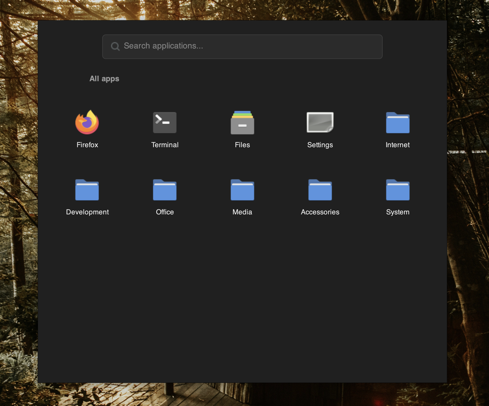

<h1>Vantyl</h1>
<figure>

<caption>Tiny app launcher for Vantum.</caption>
</figure>

## What it is

A lightweight, XML-configured app launcher with a default look.
Built with GTK3, designed to run under JWM.

## Requirements

- Python 3
- PyGObject (`gi`) with GTK 3

## Usage

```bash
python3 vantyl.py menu.xml
```

If no menu file is given (or the path doesn't exist), Vantyl falls back to a
small built-in demo menu.

## Menu format

Vantyl reads its app list from a simple XML file. Folders can nest as deep as
you like.

```xml
<menu>
    <item name="Firefox" icon="firefox" exec="firefox"/>

    <folder name="System" icon="folder">
        <item name="Settings" icon="preferences-system" exec="vantum-settings"/>
        <folder name="Advanced">
            <item name="Terminal" icon="utilities-terminal" exec="xterm"/>
        </folder>
    </folder>
</menu>
```

- `name` — label shown under the tile
- `icon` — an icon-theme name (e.g. `firefox`) **or** a real filesystem path
  (e.g. `/usr/share/icons/hicolor/48x48/apps/thunderbird.png`)
- `exec` — command run when an item is clicked (items only, not folders)

## Features

- Click a folder to drill in, back button to go up
- Search box filters across the whole menu, not just the current folder
- Falls back gracefully on missing icons, bad exec commands, or a missing/invalid menu file